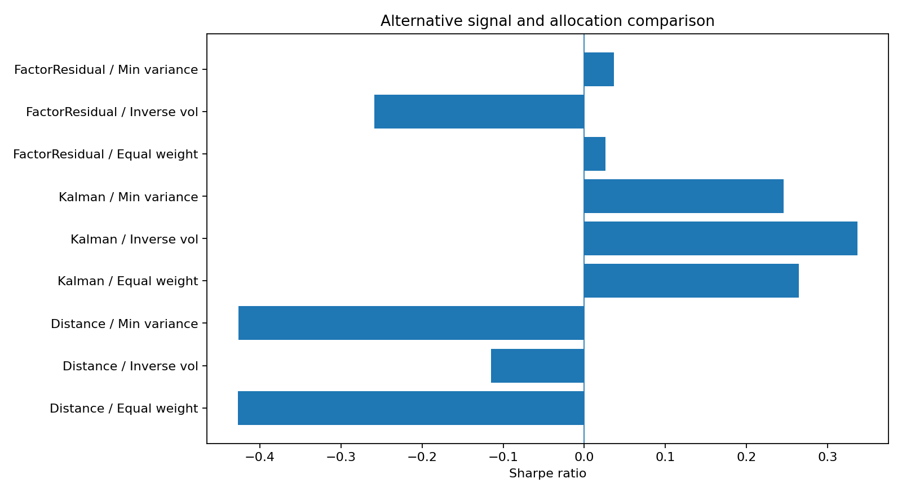
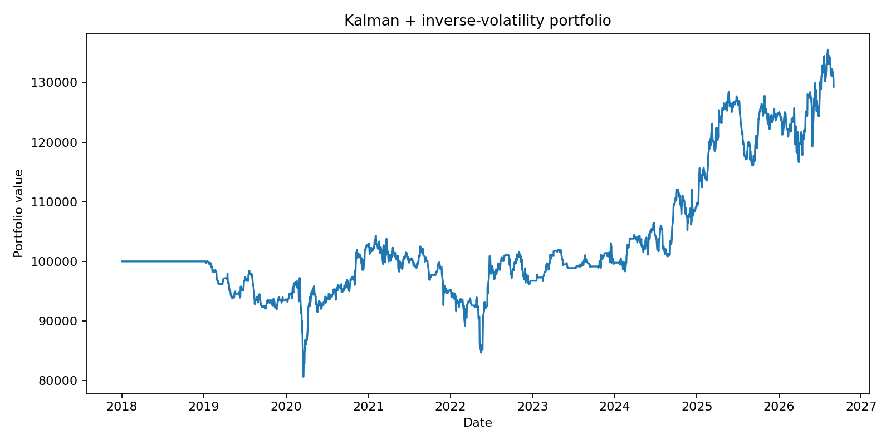

# Equity Statistical Arbitrage

A walk-forward research framework for equity relative-value trading, pair discovery, realistic execution, and multi-pair portfolio construction across US and Indian equities.

## Research question

Can economically related equities support robust statistical-arbitrage signals after out-of-sample recalibration, next-open execution, transaction costs, short-borrow costs, and portfolio-level risk controls? The project also tests whether alternative relative-value specifications improve on a conventional cointegration-based framework.

## What the project does

The Streamlit research application supports three workflows:

- **Single-pair analysis** for US and NSE equities, including bidirectional OLS/Engle-Granger estimation, spread diagnostics, half-life estimation, rolling Z-scores, execution simulation, cost attribution, sensitivity analysis, and market-beta diagnostics.
- **US peer-group scanner** for systematic within-industry pair research.
- **Multi-sector portfolio construction** using rolling formation windows, current-window cointegration/half-life eligibility, an optional past-only persistence rule, and equal-weight or inverse-volatility allocation.

The implementation deliberately separates pair quality from realised strategy performance: return or Sharpe is not used to determine rolling pair eligibility in the core portfolio workflow.

## Walk-forward methodology

The default research design uses a **252-trading-day formation window** followed by **21-trading-day trading blocks**. Model parameters and pair eligibility are estimated using information available before the relevant trading block. The application can require a pair to have passed the cointegration/half-life criteria in prior formation windows before capital is deployed.

For a conventional pair, both regression orientations are evaluated during formation. The selected orientation defines the hedge relationship and spread. Trading signals are generated from standardised spread deviations, with configurable entry, exit, upper-entry and hard-stop thresholds.

## Execution and costs

Signals are formed using information available through the close and executed through the project's next-open execution engine. The backtest supports:

- long/short pair positions;
- hedge-ratio, dollar-neutral and beta-neutral sizing for single-pair research;
- transaction costs charged per unit turnover;
- annualised short-borrow costs;
- hard-stop and mean-reversion exits;
- gross and net P&L attribution;
- trade-level ledgers and exposure diagnostics.

Default UI assumptions are 5 bps transaction cost per unit turnover and 50 bps annual short-borrow cost, but both are configurable.

## Alternative signal experiment

`experiments/walkforward_selection_experiment.py` tests three non-cointegration relative-value signal families over the same S&P 500 peer-group universe and walk-forward dates:

1. **Gatev-style distance** using normalised log-price paths.
2. **Dynamic Kalman hedge ratio** using a state-space relationship with time-varying alpha and beta.
3. **Factor/residual relative value** using residual returns after removing a peer-group common factor.

Each signal family is evaluated with:

- equal-weight active pairs;
- inverse-volatility allocation;
- constrained minimum-variance allocation.

Pair selection in this experiment uses formation-period statistics rather than future realised P&L or Sharpe, and all allocation variants consume the same underlying generated pair-strategy returns.

## Research results

The saved 2018-01-01 to 2026-09-01 comparison shows that the **Kalman + inverse-volatility** specification was the strongest of the nine tested signal/allocation combinations:

| Signal | Allocation | Annual return | Annual volatility | Sharpe | Max drawdown | Trades |
|---|---|---:|---:|---:|---:|---:|
| Kalman | Inverse volatility | 3.02% | 10.46% | **0.34** | -19.38% | 1,185 |
| Kalman | Equal weight | 2.27% | 10.64% | 0.26 | -23.40% | 1,185 |
| Kalman | Constrained minimum variance | 2.09% | 10.76% | 0.25 | -22.12% | 1,185 |
| Factor residual | Constrained minimum variance | 0.04% | 6.10% | 0.04 | -10.77% | 26,938 |
| Distance | Inverse volatility | -0.50% | 3.74% | -0.11 | -15.19% | 24,540 |

The result is intentionally presented as a research finding rather than evidence of a production-ready trading strategy. The modest Sharpe and material drawdown show that pair-model specification and portfolio construction matter, and that apparent relative-value relationships do not automatically translate into strong net returns.





Full comparison tables are included in `results/`.

## Robustness and diagnostics

The application includes parameter-sensitivity analysis, trade-level P&L and cost attribution, time-in-market and exposure analysis, industry-level mean-reversion diagnostics, and walk-forward industry-quality diagnostics. Experimental controls also allow comparison of upper-entry caps and a recent-equilibrium entry filter while holding the remaining strategy settings fixed.

## Important limitations

- **Survivorship bias:** the embedded S&P universe is a 2026 membership snapshot. Historical tests therefore retain survivorship bias even though index-addition metadata is displayed.
- **Market-data quality:** Yahoo Finance is convenient for research but is not institutional execution-grade data.
- **Execution simplification:** next-open execution is more conservative than same-close execution, but the model still does not reproduce a full limit-order book, market impact, locate constraints, or time-varying borrow availability.
- **Model risk:** cointegration, half-life, Kalman and residual-spread estimates can be unstable and are sensitive to regime changes.
- **Multiple testing:** the repository contains several research experiments. Their results should not be interpreted as untouched independent evidence after repeated investigation.
- **Not investment advice:** this is an educational quantitative-research project, not a live trading system.

## Repository structure

```text
equity-statistical-arbitrage/
├── app.py
├── analytics/
│   ├── pair_scanner.py
│   ├── performance.py
│   ├── portfolio_engine.py
│   └── sensitivity.py
├── data/
│   └── market_data.py
├── models/
│   ├── pair_model.py
│   └── walkforward.py
├── strategy/
│   ├── execution.py
│   └── sizing.py
├── experiments/
│   └── walkforward_selection_experiment.py
├── results/
├── requirements.txt
└── README.md
```

## Installation

```bash
git clone <your-repository-url>
cd equity-statistical-arbitrage
python -m venv .venv
```

Activate the environment, then install dependencies:

```bash
pip install -r requirements.txt
```

Run the research application:

```bash
streamlit run app.py
```

Run the alternative-signal experiment from the project root:

```bash
python -m experiments.walkforward_selection_experiment
```

## Example single pairs

US defaults include Visa / Mastercard. For NSE research, examples include HDFCBANK / ICICIBANK, TCS / INFY, KOTAKBANK / AXISBANK, HINDUNILVR / NESTLEIND, and RELIANCE / ONGC. NSE tickers can be entered without the `.NS` suffix.

## Tech stack

Python, Pandas, NumPy, Statsmodels, SciPy, yfinance, Plotly, and Streamlit.

## Disclaimer

This repository is for research and educational purposes only. Historical backtests are hypothetical, depend on modelling assumptions, and do not represent actual trading performance.
